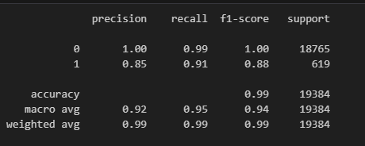

# credit-risk-classification

This project is created for the University of Minnesota = Data Visualization and Analytics Bootcamp - Module 20 Supervised Learning Challenge.

### Contributor : Indu Bandi

# Project Overview

In this project we will use various techniques to train and evaluate a model based on loan risk. we will use a dataset of historical lending activity from a peer-to-peer lending services company to build a model that can identify the creditworthiness of borrowers.

Dataset for the challenge is under the [Resources](Credit_Risk/Resources) folder.

# Data Prep

1. Read data from the [lending_data.csv](Credit_Risk/Resources/lending_data.csv), load it to dataframe and split the data into training and testing sets using `train_test_split` from sklearn.

2. Create Logistic Regression Model using the training data created from step 1

3. Save the predictions using the testing data

4. Evaluate the model's performance using the `confusion_matrix` from sklearn

# Classification Report Analysis

Classification matrix results for the Logistic Regression model that predicts the credit risk classification with two classes: 0 (low risk) and 1 (high risk) is as shown:

Here's the analysis of the performance statistics:

1. Precision:

    a. 0 (low risk) is 1.00 which means the instances predicted as low risk were actually low at risk.

    b. 1 (high risk) is 0.85 which means the out of the instances that were predicted as high risk, 85% were actually at high risk and there could be misclassification of low-risk to high-risk.

2. Recall:

    a. 0 (low risk) is 0.99 which means the model correctly identified 99% of all low-risk instances

    b. 1 (high risk) is 0.91, which means the model correctly identified 91% of high-risk instances and report suggests that the model did not identify some high-risk instances.

3. F1-Score:

    a. 0 (low risk) is 1.00 indicates perfect balance between precision and recall for this class.

    b. 1 (high risk) is 0.88 which means the model's performance is better for class 0 than for class 1.

4. Support:

    There are 18,765 instances of class 0 and 619 instances of class 1 in the dataset.

5. Accuracy:

    Overall accuracy of the model is 0.99, which means that the model correctly classified 99% of the instances in the dataset.

6. Macro Average: 

    Macro Average calculates the metric for each class and then takes the average. Since the macro average for precision, recall and F1-score is 0.92, 0.95 and 0.94 respectively, the model on average performs well across both classes.

7. Weighted Average:

    Weighted average calculates the metric for each class and then takes the weighted avergae based on the number of instances in each class. Since the precision, recall and F1-score is 0.99, 0.99, and 0.99 respectively, indicates the model's performance is really good for both classes.

## Summary

Overall, the classification report suggests that the logistic regression model is very good at predicting low risk instances and slightly less effective at predicting high risk instances where it has comparatively lower precision and recall and I would recommend this model.

